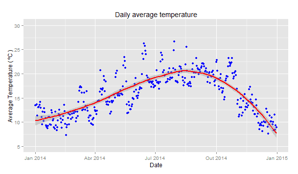

# Temperature Analysis via Spreadsheet
A python script for the analysis of Temperature in exel sheet

<p align="center"> 
    <a href="docs/TS_AveTemp.png" target="_blank"></a>
    <br />
    <b> A python script for the analysis for your [ Linux / Windows / iOS / Android Platform </b>
    <br />
</p>

# Why Shoud I Use This Project?
It helps me analyze Temperatures mentioned in the spreadsheet


Table of Contents:

- [Installation](#installation)
- [Unix](#unix)
- [Windows](#windows)
- [CMD](#cmd)
- [PowerShell](#powershell)
- [Upgrade from an Older Version](#upgrade-from-an-older-version)
- [Getting Started](#getting-started)
- [Community](#community)
- [Architecture](#architecture)
- [Contributing](#contributing)
- [Security](#security)
- [Follow Us](#follow-us)
- [License](#license)

## Installation

If you are upgrading your Appwrite server from an older version, you should use the Appwrite migration tool once your setup is completed. For more information regarding this, check out the <<link>>

### Unix

```bash
docker run -it --rm \
    --volume /var/run/docker.sock:/var/run/docker.sock \
    --volume "$(pwd)"/appwrite:/usr/src/code/appwrite:rw \
    --entrypoint="install" \
    appwrite/appwrite:1.2.1
```

### Windows

#### CMD

```cmd
docker run -it --rm ^
    --volume //var/run/docker.sock:/var/run/docker.sock ^
    --volume "%cd%"/appwrite:/usr/src/code/appwrite:rw ^
    --entrypoint="install" ^
    appwrite/appwrite:1.2.1
```

#### PowerShell

```powershell
docker run -it --rm `
    --volume /var/run/docker.sock:/var/run/docker.sock `
    --volume ${pwd}/appwrite:/usr/src/code/appwrite:rw `
    --entrypoint="install" `
    appwrite/appwrite:1.2.1
```

## Setup
You need  `python 3.5`<br>
This project depends on `panda` library install it on our system `pip install pandas` <br>
And then in our code book we need to do <br> 

```
import pandas as pd
```

### How to run?
You can run this script on your system by adding this tool to your command line

```
analyse_spreadsheet.py
```
You can use Functions directly, For example: To calculate the Mean Temperature of some data

```Python
From snalyze_spreadsheet import mean_temperature

print(mean_temperature(data))
```


### Upgrade from an Older Version


## Contributing

All code contributions, including those of people having commit access, must go through a pull request and be approved by a core developer before being merged. This is to ensure a proper review of all the code.

We truly ❤️ pull requests! If you wish to help, you can learn more about how you can contribute to this project in the <<link>>.

## Security

For security issues, kindly email us at <<link>> instead of posting a public issue on GitHub.

## Follow Us

Join our growing community around the world! Check out our official [Blog](https://medium.com/appwrite-io). Follow us on [Twitter](https://twitter.com/appwrite), [Facebook Page](https://www.facebook.com/appwrite.io), [Facebook Group](https://www.facebook.com/groups/appwrite.developers/), [Dev Community](https://dev.to/appwrite) or join our live [Discord server](https://discord.gg/GSeTUeA) for more help, ideas, and discussions.

## License

This repository is available under the [BSD 3-Clause License](./LICENSE) `||` [Apache License 2.0](./LICENSE).
