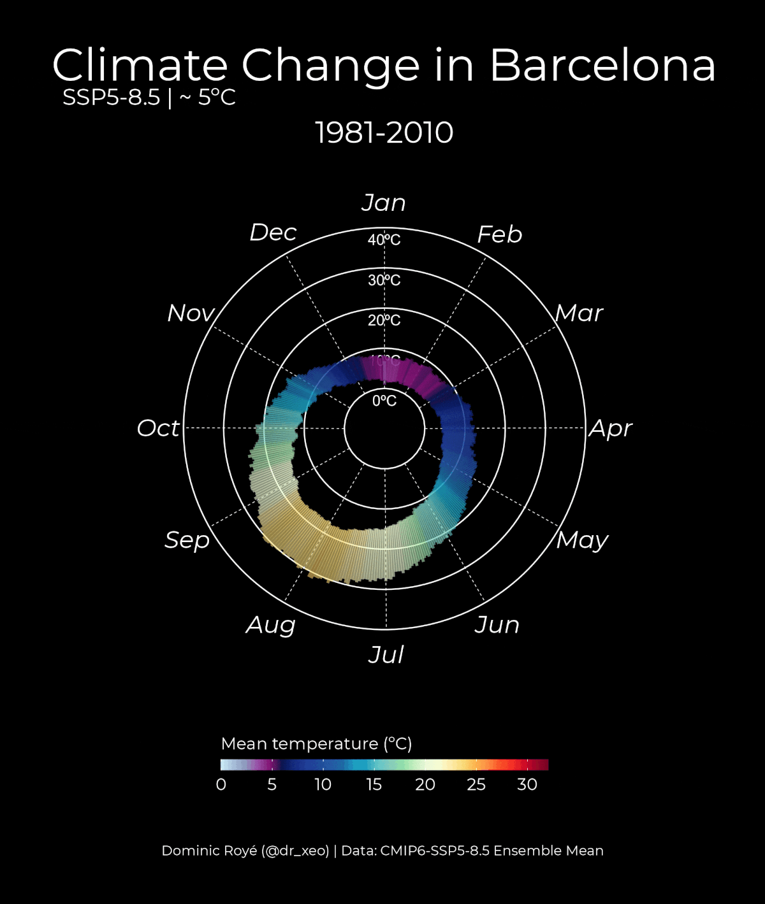

# Temperature Analysis via Spreadsheet
A python script is designed for the analysis of Temperature.This is a project that take Temperature Data in a specefic format as input from an exel sheet and display some analytic view of the data.Once the input data is loaded the script calculates verious statistical measures such as mean,median,SD and range of the data. <br>

Overall this project provides a simple and powerful tool for analyzing temperature data in Exel Spreadsheets.It allow users to quickly obtain insights about temperature patterns over time and make informed decission based on the analysis.<br>
<br>
<p align="center"> 
    <a href="docs/002_CC_Barcelona_SSP585.gif" target="_blank"></a>
    <br />
    <b> A python script for the analysis for your [ Linux / Windows / iOS / Android Platform </b>
    <br />
</p>

# Why Shoud I Use This Project?
It helps me analyze Temperatures mentioned in the spreadsheet

Table of Contents:

- [Installation](#installation)
- [Getting Started](#getting-started)
- [Contributing](#contributing)
- [Security](#security)
- [Follow Us](#follow-us)
- [License](#license)


## Installation

## Getting Started

If you are upgrading your Appwrite server from an older version, you should use the Appwrite migration tool once your setup is completed. For more information regarding this, check out the <<link>>

1.Clone this repository using this following command
```
git clone Injamulhasan/coderefinery-documentation-example-project.git
```
2.Install this required python Packages using the following command
```
pip install -r requirements.txt
```
0r Setup

You need `python 3.5` & This project also depends on `panda` library install it on our system <br>
```
pip install pandas
``` 

And then in our code book we need to do <br> 
```Python
import pandas as pd
```

### How to run?
You can run this script on your system by adding this tool to your command line

```Python
analyse_spreadsheet.py
```
You can use Functions directly, For example: To calculate the Mean Temperature of some data

```Python
From snalyze_spreadsheet import mean_temperature

print(mean_temperature(data))
```


## Contributing
1. Fork this Repository
2. Create a new branch for your feature: `git checkout -b feature/your-feature.neame`
3. Make the necessary change and commit them: `git commit -m "Add Your Commit Here"`
4. Push the change to your fork: `git push origin feature/your-feature.name`
5. Create a Pull request on the original repository

###### All code contributions, including those of people having commit access, must go through a pull request and be approved by a core developer before being merged. This is to ensure a proper review of all the code. We truly ❤️ pull requests! If you wish to help, you can learn more about how you can contribute to this project in the <<link>>.

## Security

For security issues, kindly email us at <<link>> instead of posting a public issue on GitHub.

## Follow Us

Join our growing community around the world! Check out our official medium. Follow us on Twitter, Facebook Page, Facebook Group, Dev Community or join our live Discord serverfor more help, ideas, and discussions.

## License

This repository is licensed under the  [Apache License 2.0](./LICENSE)  `Version 2.0`, January 2004
                       ` http://www.apache.org/licenses/ ` .
